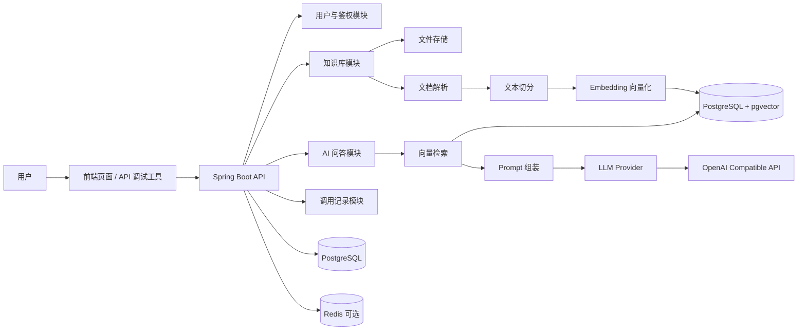

# Java AI Knowledge Base Starter（Demo）

> **Java 企业级 AI 知识库系统 · 免费演示版**
>
> 基于 **Spring Boot 4 + PostgreSQL / pgvector + MyBatis-Plus**，按 DDD 思路进行工程分层。
>
> 面向 Java 程序员、外包团队、中小企业 IT 和技术主管，用于学习、体验和验证一个可落地的企业级 AI 知识库系统应该如何设计。

---

## 目录

- [这个项目是什么](#这个项目是什么)
- [为什么做这个项目](#为什么做这个项目)
- [适合谁](#适合谁)
- [免费 Demo 能做什么](#免费-demo-能做什么)
- [免费 Demo 故意不包含什么](#免费-demo-故意不包含什么)
- [系统架构](#系统架构)
- [DDD 分层结构](#ddd-分层结构)
- [技术栈](#技术栈)
- [快速启动](#快速启动)
- [API 快速体验](#api-快速体验)
- [项目目录结构](#项目目录结构)
- [OpenSpec 工作流](#openspec-工作流)
- [路线图](#路线图)
- [免费版与商业版边界](#免费版与商业版边界)
- [商业版本](#商业版本)
- [截图](#截图)
- [常见问题](#常见问题)
- [安全说明](#安全说明)
- [作者与联系方式](#作者与联系方式)
- [许可证](#许可证)
- [致谢](#致谢)

---

## 这个项目是什么

这**不是一篇教程**，也**不是一个只会调用大模型 API 的玩具 Demo**。

这是一个面向 **Java AI 应用工程化** 的项目模板。它要回答的问题是：

> Java 程序员做 AI 应用，除了“调通大模型接口”之外，在工程化、企业级能力和可交付性上，还差哪些东西？

当前公开 Demo 已完成用户注册、登录、JWT 鉴权、DDD 工程骨架和最小 RAG 主流程：

```text
创建知识库 → 上传文档 → 文本切分 → 向量化 → 向量检索 → 组装 Prompt → AI 问答
```

它的目标不是直接替代商业系统，而是帮助你理解：

- Java 后端如何设计 RAG 知识库系统
- AI 应用如何与传统业务系统结合
- 大模型调用如何做成可维护的工程结构
- 免费 Demo 和商业交付系统之间差在哪里

---

## 为什么做这个项目

我是**磊哥**，10 年+ Java 后端开发经验，曾参与京东、同程旅行等一线互联网核心业务系统建设，长期处理高并发、高可用、缓存优化、性能治理、系统重构和工程化交付问题。

过去的 Java 项目经验让我意识到：

> AI 应用真正难的不是调通大模型接口，而是把它做成一个**可运行、可维护、可观测、可控成本、可二开、可交付**的工程系统。

所以这个项目不是为了做一个“能聊天”的 Demo，而是为了验证：

> Java 程序员如何把传统后端工程能力迁移到 AI 应用落地中。

---

## 适合谁

| 人群 | 能获得什么 |
|---|---|
| Java 程序员 | 学习 AI 应用工程化，理解 RAG 项目的后端设计 |
| 大龄 / 转型程序员 | 从 CRUD 转向产品化、项目化、交付化 |
| 外包团队 | 作为接单前的技术储备和演示模板 |
| 中小企业 IT | 快速验证内部知识库 / AI 客服可行性 |
| 技术主管 | 给团队一个 Java AI 项目的参考架构 |
| 培训机构 | 用作 Java + AI 项目实战案例 |

不适合：

- 只想一行命令直接商用上线的人
- 想找一个“全免费 + 全功能”产品的人
- 希望直接拿免费版交付客户的人
- 不关心工程结构，只想看大模型 API 调用示例的人

---

## 免费 Demo 能做什么

```text
✅ Spring Boot 后端
✅ DDD 分层结构：interfaces / application / domain / infrastructure
✅ 用户注册 / 登录 / JWT 鉴权（简化版）
✅ Docker Compose 启动 PostgreSQL / pgvector / Redis
✅ OpenSpec 规格驱动工作流
✅ 知识库、对话、LLM、计费的领域包边界
✅ 创建和查询当前用户知识库
✅ 上传 Markdown / TXT 文件
✅ 本地文件存储
✅ 固定字符数文本切分
✅ 单模型 Embedding 接入（OpenAI Compatible）
✅ PostgreSQL + pgvector 向量存储与检索
✅ 单轮 AI 问答，返回答案和引用片段
✅ 知识库归属校验，跨用户访问统一返回 404
✅ 对话会话创建、查询、归档（软删除）
✅ 按会话查看历史消息列表（append-only）
✅ 每次 LLM 调用自动记录（模型、token、耗时、状态）
✅ 调用记录按知识库和日期范围查询
```

---

## 免费 Demo 故意不包含什么

以下能力属于商业版 / 企业版的核心价值，不会在免费版中完整提供：

```text
❌ 多租户与企业组织架构
❌ 完整 RBAC 权限体系
❌ 完整 Token 统计与成本报表
❌ 多模型供应商适配：SiliconFlow / DeepSeek / Qwen / Ollama
❌ 限流、熔断、失败重试
❌ 完整调用日志与审计
❌ PDF / Word / Excel / PPT 多格式解析
❌ 文档重复上传处理
❌ 增量向量化与切片重试
❌ 管理后台完整版
❌ 私有化部署文档
❌ 二开指南与交付模板
❌ 商业授权
```

免费版解决的是：

> **这个项目是不是真的能跑？**

商业版解决的是：

> **我能不能拿它学习、二开、接单、上线和交付？**

详见：[docs/paid-version.md](docs/paid-version.md)

---

## 系统架构



---

## DDD 分层结构

```text
interfaces      接入层：REST API、DTO、参数校验、全局异常处理
application     应用层：用例编排、事务边界、命令 / 查询对象
domain          领域层：聚合根、实体、值对象、领域服务、仓储接口
infrastructure  基础设施层：数据库、向量库、文件存储、大模型 API、配置适配
common          通用能力：异常、返回结构、工具类、基础类型
```

领域上下文规划：

```text
domain.user        用户与身份上下文
domain.knowledge   知识库上下文
domain.chat        对话上下文
domain.llm         大模型供应商上下文
domain.billing     Token 与成本上下文
```

---

## 技术栈

| 组件 | 选型 | 说明 |
|---|---|---|
| 语言 | Java 21 | LTS 版本 |
| 后端框架 | Spring Boot 4.x | 主体应用框架；商业版可按客户环境提供 Spring Boot 3.x 兼容方案，默认以 3.5.x 为基线 |
| AI 集成 | LangChain4j | v0.2 起接入，用于模型调用、Embedding 和 RAG |
| 数据库 | PostgreSQL 16 | 业务数据存储 |
| 向量能力 | pgvector | 与业务库同实例，降低部署成本 |
| ORM | MyBatis-Plus | 国内 Java 项目接受度高，适合工程落地 |
| 数据迁移 | Flyway | 数据库版本管理 |
| 缓存 | Redis 7 | Docker Compose 预留服务；当前后端未启用 Redis Starter |
| 鉴权 | Spring Security + JWT | 无状态接口鉴权 |
| 文档解析 | Apache Tika / PDFBox / POI | 商业版增强 |
| 部署 | Docker Compose | 本地一键启动 |
| 工作流 | OpenSpec | 规格驱动开发与变更管理 |

### Spring Boot 版本策略

本仓库主线使用 **Spring Boot 4.x**，原因是：

```text
新项目没有历史兼容包袱
适合做面向未来的 Java AI 工程化模板
Spring Boot 4.x 与 Java 21 / Spring Framework 7 方向一致
当前核心依赖已有 Boot 4 适配版本
```

但商业交付场景会更现实：

```text
很多企业项目仍停留在 Spring Boot 3.x
客户二开时可能要求接入现有 3.x 技术栈
部分三方组件对 4.x 的适配可能滞后
```

因此本项目的原则是：

```text
免费 Demo 主线：Spring Boot 4.x
商业源码 / 企业交付：可提供 Spring Boot 3.x 兼容分支或迁移说明，默认以 3.5.x 为基线
不建议为了兼容未知客户，提前把免费 Demo 主线降级到 3.x
```

---

## 快速启动

### 1. 前置要求

请先准备：

```text
JDK 21+
Maven 3.9+
Docker + Docker Compose
一个 OpenAI Compatible 的大模型 API Key（v0.2 RAG 流程需要）
```

可选模型平台：

```text
SiliconFlow
DeepSeek
Qwen
OpenAI Compatible API Provider
本地 Ollama（商业版适配）
```

---

### 2. 克隆项目

```bash
git clone https://github.com/yourname/java-ai-kb-starter-demo.git
cd java-ai-kb-starter-demo
```

---

### 3. 启动依赖服务

```bash
docker compose up -d
```

默认会启动：

```text
PostgreSQL 16
pgvector
Redis 7
```

---

### 4. 配置本地开发参数

复制配置文件：

```bash
cp src/main/resources/application-dev.yml.example \
   src/main/resources/application-dev.yml
```

编辑 `application-dev.yml`，至少修改 JWT Secret，并填入 OpenAI Compatible 的 Chat / Embedding 配置：

```yaml
langchain4j:
  open-ai:
    chat-model:
      api-key: sk-your-real-key-here
      base-url: https://api.siliconflow.cn/v1
      model-name: Qwen/Qwen2.5-7B-Instruct
    embedding-model:
      api-key: sk-your-real-key-here
      base-url: https://api.siliconflow.cn/v1
      model-name: BAAI/bge-m3

ai-kb:
  security:
    jwt:
      secret: your-jwt-secret-at-least-32-bytes
```

> 注意：不要把真实 API Key 提交到 GitHub。

---

### 5. 启动后端

```bash
./mvnw spring-boot:run -Dspring-boot.run.profiles=dev
```

启动成功后访问：

```text
http://localhost:8080/api/v1/health
```

预期返回：

```json
{
  "status": "UP",
  "service": "ai-kb-demo-server",
  "version": "0.1.0-SNAPSHOT",
  "timestamp": "2026-04-28T16:15:00.000+08:00"
}
```

---

## API 快速体验

### 1. 注册用户

```bash
curl -X POST http://localhost:8080/api/v1/auth/register \
  -H "Content-Type: application/json" \
  -d '{
    "username": "demo_user",
    "password": "demo123456",
    "email": "demo@example.com"
  }'
```

---

### 2. 登录获取 Token

```bash
curl -X POST http://localhost:8080/api/v1/auth/login \
  -H "Content-Type: application/json" \
  -d '{
    "username": "demo_user",
    "password": "demo123456"
  }'
```

返回示例：

```json
{
  "token": "eyJhbGciOiJIUzI1NiJ9.xxx",
  "user": {
    "id": "user-id",
    "username": "demo_user"
  }
}
```

---

### 3. 查询当前用户

```bash
curl http://localhost:8080/api/v1/auth/me \
  -H "Authorization: Bearer YOUR_TOKEN"
```

---

### 4. 登出

```bash
curl -X POST http://localhost:8080/api/v1/auth/logout \
  -H "Authorization: Bearer YOUR_TOKEN"
```

---

### 5. 创建知识库

```bash
curl -X POST http://localhost:8080/api/v1/knowledge-bases \
  -H "Authorization: Bearer YOUR_TOKEN" \
  -H "Content-Type: application/json" \
  -d '{
    "name": "公司制度知识库",
    "description": "用于测试 Markdown / TXT 文档问答"
  }'
```

返回中的 `data.id` 是后续上传和问答使用的 `knowledgeBaseId`。

---

### 6. 上传 Markdown / TXT 文档

项目内置示例文档：

```text
examples/company-policy-demo.md
```

上传：

```bash
curl -X POST http://localhost:8080/api/v1/knowledge-bases/YOUR_KB_ID/documents \
  -H "Authorization: Bearer YOUR_TOKEN" \
  -F "file=@examples/company-policy-demo.md;type=text/markdown"
```

成功后文档状态应为：

```text
READY
```

---

### 7. 查询文档列表

```bash
curl http://localhost:8080/api/v1/knowledge-bases/YOUR_KB_ID/documents \
  -H "Authorization: Bearer YOUR_TOKEN"
```

---

### 8. 单轮 RAG 问答

```bash
curl -X POST http://localhost:8080/api/v1/chat \
  -H "Authorization: Bearer YOUR_TOKEN" \
  -H "Content-Type: application/json" \
  -d '{
    "knowledgeBaseId": "YOUR_KB_ID",
    "question": "公司的年假规则是什么？",
    "topK": 5
  }'
```

返回结构包含：

```text
answer      模型回答
references  检索命中的知识片段
```

如果没有检索到片段，接口会直接返回：

```text
当前知识库中没有找到相关信息
```

不会继续调用 Chat Model。

---

### 9. 创建对话会话

```bash
curl -X POST http://localhost:8080/api/v1/conversations \
  -H "Authorization: Bearer YOUR_TOKEN" \
  -H "Content-Type: application/json" \
  -d '{
    "knowledgeBaseId": "YOUR_KB_ID",
    "title": "年假规则咨询"
  }'
```

返回中的 `data.id` 是后续带历史问答使用的 `conversationId`。

---

### 10. 带会话问答

```bash
curl -X POST http://localhost:8080/api/v1/chat \
  -H "Authorization: Bearer YOUR_TOKEN" \
  -H "Content-Type: application/json" \
  -d '{
    "knowledgeBaseId": "YOUR_KB_ID",
    "conversationId": "YOUR_CONVERSATION_ID",
    "question": "公司的年假规则是什么？",
    "topK": 5
  }'
```

带 `conversationId` 时会保存用户消息、助手消息，并记录一次基础调用记录。

---

### 11. 查询会话消息

```bash
curl http://localhost:8080/api/v1/conversations/YOUR_CONVERSATION_ID/messages \
  -H "Authorization: Bearer YOUR_TOKEN"
```

消息列表默认最多返回 `ai-kb.chat.max-list-results` 条。免费 Demo 默认值为 `100`，这是为了避免一次性返回过多历史数据的演示保护值，不是业务上限；真实项目建议使用分页游标。

---

### 12. 查询调用记录

```bash
curl "http://localhost:8080/api/v1/invocation-logs?knowledgeBaseId=YOUR_KB_ID&dateFrom=2026-01-01&dateTo=2026-01-31" \
  -H "Authorization: Bearer YOUR_TOKEN"
```

免费 Demo 的调用记录只保存基础元数据：模型名、token 数、耗时、状态、错误摘要，不保存完整请求/响应内容，也不提供成本报表和审计后台。

---

## 项目目录结构

```text
java-ai-kb-starter-demo/
├── README.md
├── LICENSE
├── docker-compose.yml
├── pom.xml
├── docs/
│   ├── quick-start.md
│   ├── architecture.md
│   ├── paid-version.md
│   └── faq.md
├── src/
│   ├── main/
│   │   ├── java/com/brolei/aikb/
│   │   │   ├── AiKbApplication.java
│   │   │   ├── interfaces/
│   │   │   │   ├── rest/
│   │   │   │   ├── dto/
│   │   │   │   └── exception/
│   │   │   ├── application/
│   │   │   │   ├── user/
│   │   │   │   ├── knowledge/
│   │   │   │   └── chat/
│   │   │   ├── domain/
│   │   │   │   ├── user/
│   │   │   │   ├── knowledge/
│   │   │   │   ├── chat/
│   │   │   │   ├── llm/
│   │   │   │   └── billing/
│   │   │   ├── infrastructure/
│   │   │   │   ├── persistence/
│   │   │   │   └── security/
│   │   │   └── common/
│   │   └── resources/
│   │       ├── application.yml
│   │       ├── application-dev.yml.example
│   │       └── db/migration/
│   └── test/
├── examples/
│   └── company-policy-demo.md
├── screenshots/
│   └── .gitkeep
└── openspec/
    ├── config.yaml
    ├── changes/                # 进行中的规格变更
    └── specs/
        └── user/auth.md        # 当前稳定规格
```

---

## OpenSpec 工作流

本项目使用 OpenSpec 做变更管理，重要功能变更都会走以下流程：

```text
提出变更提案 proposal（openspec/changes/）
        ↓
补充设计说明 design
        ↓
拆分任务清单 tasks
        ↓
落地实现 apply
        ↓
沉淀为稳定规格 specs
```

当前公开仓库保留稳定规格：

```bash
ls openspec/specs/
```

当前已沉淀的规格：

```text
openspec/specs/
├── knowledge/
│   └── rag.md
└── user/
    └── auth.md
```

`openspec/changes/archive/` 属于本地过程记录，默认不提交到公开 Demo，避免读者被历史草稿干扰。

---

## 路线图

| 阶段 | 目标 | 状态 |
|---|---|---|
| v0.1 | 用户注册 / 登录 / JWT 鉴权 | ✅ 已完成 |
| v0.2 | 跑通上传 → 切分 → 向量化 → 检索 → 问答主流程 | ✅ 已完成 |
| v0.3 | 对话历史、基础调用记录 | ✅ 已完成 |
| v0.4 | Docker Compose 一键启动、截图、演示视频 | 📋 计划中 |
| v1.0 | 商业版本开放咨询 | 📋 计划中 |

---

## 免费版与商业版边界

| 能力 | 免费 Demo | 商业版 |
|---|---:|---:|
| Spring Boot 后端 | ✅ | ✅ |
| DDD 分层结构 | ✅ | ✅ |
| 用户登录 | ✅ 简化版 | ✅ 完整版 |
| 知识库管理 | ✅ 当前用户知识库 | ✅ 多知识库 / 多租户 |
| 文件上传 | ✅ TXT / Markdown | ✅ PDF / Word / Excel / PPT |
| 文本切分 | ✅ 简单切分 | ✅ 可配置切分策略 |
| Embedding | ✅ 单模型 | ✅ 多模型 |
| 向量库 | ✅ pgvector | ✅ pgvector / Milvus / ES |
| AI 问答 | ✅ 单轮 / 引用来源 | ✅ 多轮 / Prompt 模板 |
| Token 统计 | ❌ | ✅ |
| 成本报表 | ❌ | ✅ |
| 调用记录 | ✅ 基础记录 | ✅ 完整审计 |
| 限流 / 熔断 / 重试 | ❌ | ✅ |
| 管理后台 | ❌ | ✅ |
| 二开文档 | ❌ | ✅ |
| 私有化部署文档 | ❌ | ✅ |
| 商业授权 | ❌ | ✅ |

---

## 商业版本

商业版本不是简化 Demo，而是一套面向**真实项目交付**的 Java AI 知识库系统。

相比免费 Demo，商业版本重点补齐：

```text
完整后端源码
完整前端源码
多模型供应商适配
SiliconFlow / DeepSeek / Qwen / OpenAI Compatible / Ollama
完整 RAG 流程
重复上传处理
增量向量化
切片失败重试
Token 统计与成本报表
调用日志与审计
限流、熔断、失败重试
管理后台完整版
PDF / Word / Excel / PPT 多格式文档解析
二开指南
接口文档
视频讲解
私有化部署文档
Docker / K8s 部署脚本
商业授权书
交付模板
```

### 商业版本类型

| 版本 | 适合人群 | 内容说明 |
|---|---|---|
| 免费 Demo | 学习、体验、验证方向 | 本仓库提供，当前 v0.3 已跑通用户鉴权、RAG 主流程、对话历史与调用记录 |
| 进阶版 | 想学习完整项目、自己二开 | 完整源码、启动文档、基础二开说明 |
| 专业版 | 接单、公司内部项目、小团队落地 | 多模型适配、Token 统计、调用日志、管理后台、视频讲解 |
| 陪跑版 | 需要部署指导、架构答疑、二开规划 | 专业版内容 + 1v1 架构答疑 + 部署指导 |
| 企业版 | 私有化部署、定制开发、交付验收 | 企业环境部署、功能定制、交付文档、培训支持 |

如需商业版、源码授权、陪跑服务或企业私有化交付，请通过下方联系方式咨询。

为避免版本差异和服务范围误解，具体费用会根据授权范围、服务内容、交付方式和是否需要企业定制单独确认。

---

## 截图

当前版本暂无前端页面截图。v0.3 已跑通对话历史与调用记录 API，后续补充演示截图或前端页面。

---

## 常见问题

### 1. 这个项目可以直接商用吗？

免费 Demo 不提供商业授权，不能直接用于商业项目、客户交付、二次销售或改名发布。

如需商业使用，请联系作者获取商业授权或企业版本。

---

### 2. 为什么免费版不提供完整 Token 统计？

Token 统计、成本报表、调用日志、审计、限流和失败重试属于真实项目交付能力，是商业版本的核心价值。

当前免费版先用于学习和体验工程骨架、最小 RAG 主链路、基础对话历史与基础调用记录，不包含商业交付所需的完整治理能力。

---

### 3. 为什么选 PostgreSQL + pgvector？

因为 Demo 阶段最重要的是降低部署成本。

如果一开始就引入独立向量数据库，会增加部署复杂度。PostgreSQL + pgvector 可以让业务数据和向量数据放在同一个数据库实例里，更适合免费 Demo 和个人学习。

商业版本会根据场景支持 Milvus、Elasticsearch 或其他向量检索方案。

---

### 4. 为什么不是 Python？

Python 更适合快速验证模型能力，但 Java 在企业系统中有明显优势：

```text
权限体系
业务系统集成
事务一致性
工程规范
部署治理
稳定性建设
团队接受度
```

这个项目关注的是：

> Java 程序员如何把 AI 能力接入真实业务系统。

---

### 5. 为什么免费版不直接放完整管理后台？

管理后台、权限体系、成本报表、调用审计、部署脚本和二开文档，是从 Demo 走向真实交付的关键部分。

免费版会逐步保持主流程可运行，商业版本会补齐完整交付能力。

---

### 6. 可以提交 PR 吗？

可以提交 Issue 反馈问题，也欢迎提交文档、Bug 修复类 PR。

但免费 Demo 会控制复杂度，暂不接受会显著扩大范围的功能 PR，例如：

```text
完整 RBAC
多租户
完整管理后台
多模型商业适配
企业级部署脚本
```

这些能力会放在商业版本或后续规划中。

---

## 安全说明

请不要提交以下内容到仓库：

```text
真实 API Key
生产数据库密码
企业内部文档
客户数据
真实业务合同
个人隐私信息
```

如果你要把 Demo 部署到公网，请至少增加：

```text
HTTPS
登录失败限流
接口频率限制
强 JWT Secret
数据库访问控制
API Key 环境变量管理
```

免费 Demo 默认面向本地学习，不默认承担公网生产安全边界。

---

## 作者与联系方式

**磊哥** — 专注 Java AI 应用工程化

10 年+ Java 后端开发经验，曾参与京东、同程旅行等一线互联网核心业务系统建设，长期关注高并发系统、缓存优化、性能治理、架构重构和工程化交付。

现在主要记录：

- Java 程序员如何从传统后端转向 AI 应用工程化
- Spring Boot / RAG / 大模型 API 如何做成可交付项目
- 企业级 AI 知识库、AI 客服、智能助手系统如何从 Demo 走向产品化

公开平台：

```text
公众号：待补
知乎：待补
掘金：待补
B站：待补
GitHub：待补
Gitee：待补
邮箱：待补
```

付费咨询、源码授权、陪跑合作、企业私有化交付，请通过邮箱联系，邮件主题注明：

```text
AI 知识库 + 来源平台 + 合作类型
```

---

## 许可证

本仓库采用 **Source Available License**，详见：[LICENSE](LICENSE)

允许：

```text
✅ 学习
✅ 研究
✅ 非商业引用
✅ 本地运行体验
```

禁止：

```text
❌ 商业使用
❌ 二次销售
❌ 去除版权信息
❌ 改名后重新发布为同类商业产品
❌ 直接用于客户交付
```

如需商业授权，请联系作者获取商业版本或企业授权。

---

## 致谢

这个项目是我从“10 年+ Java 工程经验”走向“Java AI 应用工程化服务提供者”的公开构建记录。

如果它对你有帮助，欢迎：

```text
Star
Issue
Discussion
转发给正在转型 AI 应用开发的 Java 程序员
```

> 年轻开发者在卷 AI 新知识，老 Java 程序员要把优势放在工程化、业务理解和真实交付上。
